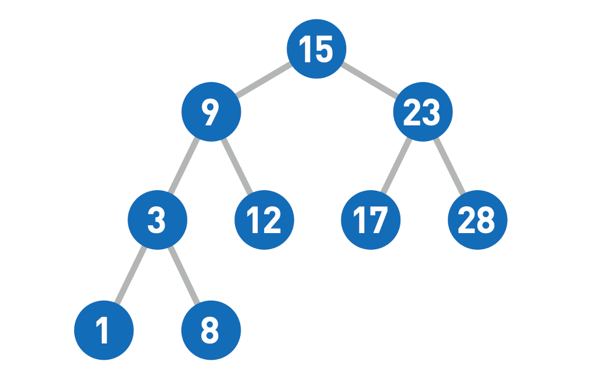

# 二叉树的遍历

二叉树本质上可以理解为链表的一种扩展。对于单向链表而言，每个节点都有一个指针指向下一个节点。如果将这个指针增加为两个，即每个节点都有两个指针指向两个字节点，这个链表就变成了一颗二叉树。为了方便起见，我们可以将这两个指针分别命名为left和right，以表示左子节点和右子节点。

我们可以通过一个简单的递归算法来输出二叉树中的所有元素。常见的遍历方法包括**中序遍历(LDR)**、**先序遍历(DLR)**和**后序遍历(LRD)**。

> 先序遍历指的是输出的子树根的关键字位于其左子树的关键字和右子树的关键字值之间。类似地，先序遍历中输出的根的关键字在其左右子树的关键字之前；后序遍历输出的根的关进子在其左右子树的关键字值之后。[^ 1 ]

以上述二叉树为例，不同的遍历方式得到的序列分别是：

**前序遍历：**15 -> 9 -> 3 -> 1 -> 8 -> 12 -> 23 -> 17 -> 28

**中序遍历：**1 -> 3 -> 8 -> 9 -> 12 -> 15 -> 17 -> 23 -> 28

**后序遍历：**1 -> 8 -> 3 -> 12 -> 9 -> 17 -> 18 -> 23 -> 15

## 中序遍历实现

~~~java
class Solution {

    private List<Integer> result = new ArrayList<>();

    public List<Integer> inorderTraversal(TreeNode root) {
        if (root == null) {
            return new ArrayList<>();
        }
        if (root.left != null) {
            inorderTraversal(root.left);
        }
        result.add(root.val);
        if (root.right != null) {
            inorderTraversal(root.right);
        }
        return result;
    }
}
~~~

## 前序遍历实现

~~~java
class Solution {

    private List<Integer> result = new LinkedList<>();

    public List<Integer> preorderTraversal(TreeNode root) {
        if (root == null) {
            return new LinkedList<>();
        }
        result.add(root.val);
        if (root.left != null) {
            preorderTraversal(root.left);
        }
        if (root.right != null) {
            preorderTraversal(root.right);
        }
        return result;
    }
}
~~~

## 后续遍历实现

~~~java
class Solution {

    private List<Integer> result = new LinkedList<>();

    public List<Integer> postorderTraversal(TreeNode root) {

        if (root == null) {
            return new LinkedList<>();
        }
        if (root.left != null) {
            postorderTraversal(root.left);
        }
        if (root.right != null) {
            postorderTraversal(root.right);
        }
        result.add(root.val);
        return result;

    }
}
~~~

## 三种遍历方式的时间复杂度分析

对于一颗空树而言，三种遍历方式执行的都是：

~~~java
if (root == null) {
    return new LinkedList<>();
}
~~~

可以视为常数时间，即：$T(0) = c$。

对于n>0的情况，假设当前节点的左边有k个节点，那么可以算出来该节点的右边有n-k-1个节点，因此运行时间符合下列算式：$T(n) \leqslant T(k) + T(n-k-1) + d$，其中常数d大于0。
$$
\begin{array}{l}
T(n) \leqslant T(k) + T(n-k-1) + d \\
	= ((c + d)k + c) + ((c + d)(n - k - 1) + c) + d\\
	= (c + d)n + c - (c + d) + c + d\\
	= (c + d)n + c
\end{array}
$$
即$T(n) = O(n)$

> ~~~pseudocode
> INORDER-TREE-WALK(x)
> 	if x != NIL
> 		INORDER-TREE-WALK(x.left)
> 		print x.key
> 		INORDER-TREE-WALK(x.right)
> ~~~
>
> 定理：如果x是一棵有n个结点子树的根，那么调用INORDER-TREE-WALK(x)需要Θ(n)时间。[^ 2 ]

[^ 1 ]:Paul W. Purdom, Jr. and Cynthia A. Brown. *The Analysis of Algorithms*. Holt, Rinehart, and Winston, 1985.
[^ 2 ]: Michael O. Rabin. Probabilistic algorithms. In J. F. Traub, editor, Algorithms and Complexity: *New Directions and Recent Results*, pages 21-39. Academic Press, 1976.